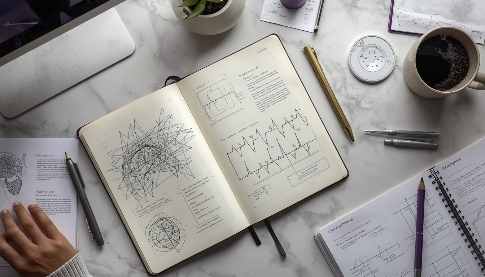

# ✨ Ivory Editorial Antigravity
### *The Definitive AI-Powered Professional Presence Engine*

[](https://reactjs.org/)
[](https://fastapi.tiangolo.com/)
[](https://vitejs.dev/)
[](https://developer.mozilla.org/en-US/docs/Web/CSS)

---

## 📖 Overview

**Ivory Editorial Antigravity** is not just a portfolio; it is a sophisticated **Neural Artifact Management System**. Designed for elite AI/ML engineers and researchers, it blends high-end editorial typography with a robust localization engine capable of generating ATS-compliant resumes across 7+ regional markets (Japan, Korea, China, USA, India, and Europe).

> "A good README can literally make a mediocre project look respectable. This project aim for visual and technical excellence."

---

## 🖼️ Visual Showcase

| 🖥️ Portfolio Core | 🛠️ Secure Admin Vault |
| :--- | :--- |
|  || *High-end minimalist landing with glassmorphism.* | *The neural command center for artifact management.* |

---

## 🛠️ Tech Stack & Architecture

### **Frontend Infrastructure**
- **React 18 & Vite**: For lightning-fast hot module replacement and sub-second initial load.
- **Framer Motion**: Powering the "Antigravity" signature smooth transitions and micro-animations.
- **Lucide Icons**: A curated set of high-stroke-weight icons for that premium editorial feel.

### **Backend Core**
- **FastAPI (Python)**: High-performance asynchronous API layer.
- **Playwright PDF Engine**: Real-time generation of complex, localized HTML templates into pixel-perfect PDF resumes.
- **Groq & Llama 3**: Powering the "Enrich Sequence" for automated professional narrative synthesis.
- **SQLite with FileLock**: Robust, concurrency-safe data persistence for multi-admin stability.

---

## 🚀 Key Features

- **🌍 Global Localization Engine**: Intelligent regional routing. Automatically generates specialized resumes (e.g., Japanese *Rirekisho*, Korean *Shokumu Keirekisho*, and Chinese professional standards).
- **🤖 AI Narrative Synthesis**: Uses neural engines to expand single-sentence notes into two-paragraph professional summaries optimized for ATS.
- **🧠 Neural Scroll-Sync**: A revolutionary dual-iframe verification suite that synchronizes scrolling between reference English resumes and localized target resumes for instant auditing.
- **📡 Terminal AI Control**: A command-line interface within the Admin Panel for direct system telemetry and "Commit-to-Pulse" updates.
- **🛡️ Secure Vault Entry**: Password-gated administrative access with full encryption of professional identity data.

---

## 📥 Installation & Documentation

### **Prerequisites**
- Node.js (v18+)
- Python 3.10+
- Groq API Key (for AI features)

### **Setup Sequence**

1. **Clone the Repository**
   ```bash
   git clone https://github.com/your-repo/ivory-antigravity.git
   cd ivory-antigravity
   ```

2. **Backend Initialization**
   ```bash
   cd backend
   python -m venv venv
   source venv/bin/activate  # or venv\Scripts\activate on Windows
   pip install -r requirements.txt
   uvicorn main:app --reload
   ```

3. **Frontend Initialization**
   ```bash
   cd ../frontend
   npm install
   npm run dev
   ```

---

## 🔭 Future Horizon

- **[ ] WebGL Hero Interactive**: A fully 3D interactive "Artifact Cloud" for the landing page.
- **[ ] Multi-Agent Peer Review**: AI agents that simulate an HR interview based on your current artifacts to provide a "Market Readiness Score".

---

*Curated with precision by **Divya Nirankari***  
*Copyright © 2026 // NEURAL_CORE_V8*
